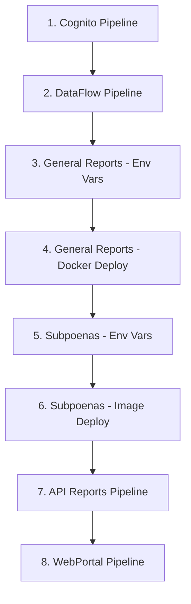

# QSR-2666059 - Documentación de Referencia

Este documento complementa la documentación de pases a producción con información específica del QSR-2666059 y los archivos asociados.

## 📄 Archivos de Referencia

### QSR-2666059 - CICD QSR Pipelines Instructions to Deploy

**Archivo**: `files/qsr/QSR-2666059 - CICDQSRPipelinesInstructions_toDeploy.docx`

**Contenido esperado**:

- Instrucciones detalladas para ejecutar pipelines
- Secuencia específica de deployment
- Validaciones requeridas entre pasos
- Configuraciones específicas para producción

### QSR-2666059 - Test Script Pipeline

**Archivo**: `files/qsr/QSR-2666059 - Test Script-Pipeline.docx`

**Contenido esperado**:

- Scripts de validación post-deploy
- Test cases específicos para verificación
- Criterios de aceptación
- Procedimientos de rollback

## 🔗 Mapeo de Pipelines con QSR

### Identificadores de Pipelines Completos

Los siguientes son los pipelines completos con sus identificadores únicos utilizados en el QSR-2666059:

#### 1. DataFlow Pipeline

**ID Completo**: `ATHM-CRT-ANL-DataFlow-Pipeline-Pipeline9850B417-1SU4MB59FO9RK`

- **Propósito**: Procesamiento de datos y ETL
- **Dependencias**: Bases de datos origen, S3, Redshift
- **Orden de ejecución**: Segundo (después de Cognito)
- **Validación**: Verificar conteos de registros procesados

#### 2. Subpoenas Environment Variables

**ID Completo**: `ATHM-CRT-ANL-REPORTING-API-SERVICE-Pipeline-Pipeline9850B417-iRVIprGBMHG7`

- **Propósito**: Configuración de variables de entorno para API de subpoenas
- **Dependencias**: AWS Parameter Store, Secrets Manager
- **Orden de ejecución**: Quinto
- **Validación**: Verificar variables aplicadas correctamente

#### 3. Subpoenas Image Deployment

**ID Completo**: `ATHM-CRT-ANL-REPORTING-API-DEPLOYMENT-Pipeline-Pipeline9850B417-12F6Z3GQ6C7C0`

- **Propósito**: Despliegue de imagen Docker para API de subpoenas
- **Dependencias**: ECR, ECS, Load Balancer
- **Orden de ejecución**: Sexto (después de variables)
- **Validación**: Health checks y smoke tests

#### 4. API Reports Pipeline

**ID Completo**: `ATHM-CRT-ANL-ApiReports-Pipeline-Pipeline9850B417-DJTE60KCVPZ0`

- **Propósito**: Despliegue del API principal de reportes
- **Dependencias**: General Reports service
- **Orden de ejecución**: Séptimo
- **Validación**: Swagger UI y endpoints funcionales

#### 5. Cognito Pipeline

**ID Completo**: `ATHM-CRT-Anl-Cognito-Pipeline-Pipeline9850B417-1ROP74K2U6WPO`

- **Propósito**: Configuración de autenticación y usuarios
- **Dependencias**: LDAP, identity providers
- **Orden de ejecución**: Primero
- **Validación**: Login test exitoso

#### 6. General Reports Docker Deployment

**ID Completo**: `ATHM-CRT-ANL-GENERAL-REPORTS-DEPLOYMENT-Pipeline-Pipeline9850B417-7FejzdexeJWP`

- **Propósito**: Despliegue Docker del servicio de reportes generales
- **Dependencias**: Variables de entorno configuradas
- **Orden de ejecución**: Cuarto
- **Validación**: Service health check

#### 7. General Reports Environment Variables

**ID Completo**: `ATHM-CRT-ANL-GENERAL-REPORTS-SERVICE-Pipeline-Pipeline9850B417-2L6Ncb9PxMBX`

- **Propósito**: Configuración de variables para reportes generales
- **Dependencias**: Parameter Store
- **Orden de ejecución**: Tercero
- **Validación**: Variables aplicadas correctamente

#### 8. WebPortal (Frontend)

**ID Completo**: `ATHM-CRT-ANL-WebPortal-Pipeline-Pipeline9850B417-PDEHLPBUZJ2O`

- **Propósito**: Despliegue del portal web frontend
- **Dependencias**: APIs desplegadas y funcionales
- **Orden de ejecución**: Octavo (último)
- **Validación**: Portal accesible y funcional

## 🎯 Secuencia de Ejecución Recomendada

### Orden Óptimo para QSR-2666059

### Tiempo Estimado Total

| Fase | Pipelines | Tiempo Estimado |
|------|-----------|----------------|
| **Infraestructura Base** | Cognito + DataFlow | 20-38 min |
| **General Reports** | Env Vars + Docker | 11-17 min |
| **Subpoenas** | Env Vars + Image | 13-20 min |
| **APIs y Frontend** | API Reports + WebPortal | 20-32 min |
| **Total** | 8 pipelines | **64-107 min** |

### Ventanas de Tiempo Críticas

- **Cognito → DataFlow**: Máximo 5 minutos de espera
- **General Reports Env → Docker**: Inmediato (sin espera)
- **Subpoenas Env → Image**: Inmediato (sin espera)
- **API Reports → WebPortal**: Máximo 10 minutos de espera

## ✅ Criterios de Validación por QSR

### Validaciones Técnicas Obligatorias

#### Post-Cognito
- [ ] Login test con usuario real
- [ ] Token generation funcionando
- [ ] SAML/LDAP connectivity OK

#### Post-DataFlow
- [ ] Registros procesados = registros esperados
- [ ] Datos en destino con calidad correcta
- [ ] No hay duplicados o datos corruptos

#### Post-General Reports
- [ ] Service health endpoint respondiendo 200
- [ ] Variables de entorno aplicadas
- [ ] Conexión a base de datos exitosa

#### Post-Subpoenas
- [ ] API endpoints respondiendo
- [ ] Documentación Swagger disponible
- [ ] Proceso completo de subpoena funcional

#### Post-API Reports
- [ ] Todos los endpoints documentados disponibles
- [ ] Performance dentro de SLAs
- [ ] Integración con otros servicios OK

#### Post-WebPortal
- [ ] Portal accesible desde internet
- [ ] Login y logout funcional
- [ ] Generación de reportes desde UI
- [ ] Descarga de archivos operativa

### Validaciones de Negocio Obligatorias

#### Flujos Críticos
- [ ] **Creación de Subpoena**: Completo end-to-end
- [ ] **Generación de Reporte General**: Con datos reales
- [ ] **Autenticación de Usuario**: Login/logout completo
- [ ] **Búsqueda y Filtrado**: Funcionalidad completa
- [ ] **Exportación de Datos**: PDF y Excel

#### Performance Requirements
- [ ] **Login**: < 3 segundos
- [ ] **Generación de Reportes**: < 30 segundos
- [ ] **Carga de Páginas**: < 5 segundos
- [ ] **APIs**: < 2 segundos response time

## 🚨 Escalación Específica QSR-2666059

### Contactos Primarios

**DevOps Lead**: Hector Granada
- **Responsabilidad**: Aprobación de pipelines críticos
- **Escalación**: Issues de infraestructura
- **Disponibilidad**: 24/7 durante deploy window

**QSR Owner**: [Nombre del solicitante]
- **Responsabilidad**: Validación de negocio
- **Escalación**: Funcionalidad no cumple requisitos
- **Disponibilidad**: Durante horario de deploy

### Procedimiento de Escalación QSR

#### Level 1 (0-15 minutos)
1. Pipeline failure → DevOps team
2. Functional issue → Development team
3. Business validation fail → QSR Owner

#### Level 2 (15-30 minutos)
1. Infrastructure decision → Hector Granada
2. Architecture decision → Tech Lead
3. Business decision → Product Owner

#### Level 3 (30+ minutos)
1. Go/No-Go decision → Project Manager
2. External communication → Stakeholder team
3. Rollback authorization → Change Advisory Board

## 📊 Métricas de Éxito QSR-2666059

### Technical Success Metrics

- [ ] **Deployment Success Rate**: 100% (8/8 pipelines)
- [ ] **Total Deployment Time**: < 3 horas
- [ ] **Post-Deploy Error Rate**: < 1%
- [ ] **System Availability**: > 99.9%
- [ ] **Rollback Time** (if needed): < 30 minutos

### Business Success Metrics

- [ ] **User Login Success Rate**: > 98%
- [ ] **Report Generation Success**: > 95%
- [ ] **System Performance**: Cumple SLAs
- [ ] **Zero Critical Issues**: En primera hora post-deploy
- [ ] **User Satisfaction**: Sin quejas críticas

### Reporting Requirements

#### Durante el Deploy
- Status update cada 30 minutos
- Immediate notification de cualquier issue
- Real-time monitoring dashboard disponible

#### Post-Deploy
- Reporte de éxito dentro de 2 horas
- Métricas de performance en 24 horas
- Post-mortem si hubo issues (dentro de 48 horas)

---

## 🔗 Navegación QSR

### 📋 Documentos Relacionados

- [← Volver al Índice QSR](./01-README.md)
- [🏗️ Detalles de Pipelines →](./02-pipelines-produccion.md)
- [🚀 Proceso Completo →](./03-proceso-deploy.md)
- [✅ Checklist para Deploy →](./04-checklist-qsr.md)
- [🚨 Solución de Problemas →](./05-troubleshooting-produccion.md)

### 📁 Archivos de Referencia

- [📄 Archivos QSR Originales](../../files/qsr/) - Documentos Word fuente
- [📋 CI/CD Principal](../04-cicd.md) - Jenkins y procesos
- [🐳 Docker/AWS](../05-docker-aws.md) - Infraestructura
- [📊 New Relic](../06-newrelic.md) - Monitoreo

### 🔧 Configuraciones

- [Variables de Entorno](../general/variables_entorno.md) - Configuraciones del sistema
- [Casos de Uso](../general/casos-uso.md) - Flujos de negocio
- [Backend](../02-backend.md) - APIs y microservicios
- [Frontend](../03-frontend.md) - WebPortal

---

**QSR Reference**: QSR-2666059  
**Documento creado**: Agosto 2025  
**Última actualización**: [Fecha del deploy]  
**Próxima revisión**: Post-deployment review
